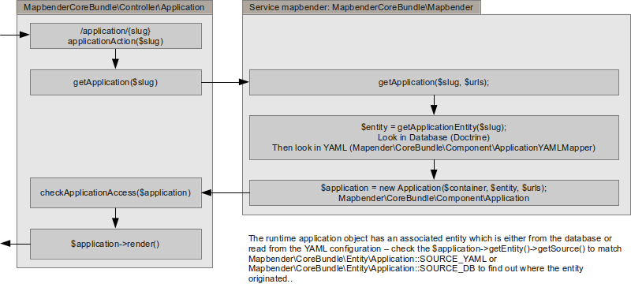

Request / Response Workflow
###########################

Dieses Dokument erklärt den Request/Response Workflow von Mapbender3. Es existieren drei Abläufe, die bekannt sein sollten:

* Anwendungs Workflow
* Element Workflow 
* Manager Modul Workflow 

Anwendungs Workflow
********************
Die Standardanwendung controller /application/{slug} steuert die Mapbender\CoreBundle\Controller\Application::applicationAction($slug)-Funktion. Dieses funktioniert folgendermaßen:

Grundsätzlich fragt der Controller den Mapbender-Service nach einer Anwendung mit dem gegebenen Namen Slug zu suchen. Zunächst sucht der Mapbender-Service die Anwendung in der Datenbank und nur, wenn er sie dort nicht findet, wird in den Anwendungen, die in der Konfigurations-YAML definiert sind, gesucht.

Die dadurch geladene Entität der Klasse Mapbender\CoreBundle\Entity\Application wird mit ihrem Ursprung in dem Source-Attribut, das entweder Mapbender\CoreBundle\Entity\Application::SOURCE_YAML oder Mapbender\CoreBundle\Entity\Application::SOURCE_DB ist, getaggt. 

Die Entität wird an den Constructor des Laufzeit-Anwendungsobjektes der Klasse Mapbender\CoreBundle\Component\Application weitergeleitet, welches die Logik beinhaltet, während die Entität die Daten enthält.

Zugriffsprüfungen werden nicht im Mapbender-Service, in der Entität oder in der Anwendung vorgenommen, sondern in der Funktion getApplication des Controllers. Behalten Sie dies im Hinterkopf, wenn Sie Ihren eigenen Controller entwickeln wollen.

Element-Rendering-Workflow
**************************
Bei dem Anwendungsrendering ist jedes Element aufgefordert, sich selbst zu rendern. Der Arbeitsablauf ist ein wenig kompliziert, aber grundsätzlich fragt die Anwendung ihre Vorlage, sich selbst zu rendern, welches die Vorlagen-Iteration für jedes Element und das Aufrufen der Elementrendering-Funktion beinhaltet.

Die Render-Funktion verwendet normalerweise Twig zum Rendern eines HTML-Fragments. Dieses Fragment muss ein ID-Attribut enthalten, das der ID des Elements dynamisch von der Mapbender-Anwendung gegeben wird. Da diese IDs dynamisch generiert werden, dürfen Sie diese nicht für das Styling in ihrer Element-CSS verwenden.

Die Anwendung iteriert über jedes Element und ruft die getConfiguration-Methode auf, um alle Elementkonfiguration-Arrays zu sammeln, die clientsetig in der Mapbender.configuration.elements-Variable verfügbar sind .- sowie zu jeder Element Widget Konstruktionsmethode.

Die Konfiguration der Elemente ist verfügbar:

* In der Render-Funktion des Elements, welche die Konfiguration an die Twig-Datei weitergeben kann.
* In der Widget-Methode des Elements "this->options". 
* In der Mapbender.configuration.elements JavaScript-Variable (für alle Elemente)

Element Callback Workflow
*************************
Der übliche Element-Callback /application/{slug}/element/{id}/{action} wird an die Funktion  Mapbender\CoreBundle\Controller\ApplicationController::elementAction($slug, $id, $action) geleitet.

Diese Funktion erledigt das gleiche wie applicationAction, um das Anwendungsobjekt zu erhalten. Dadurch wird der Zugriff auf die Anwendung geprüft. Es ist kein Zugriff auf das Element-Callback möglich, wenn der Benutzer nicht die Erlaubnis hat, die Anwendung zu verwenden.

Das Element wird erneuert und der Zugriff auf das Element wird, basierend auf der Rolle des aktuellen Benutzers, geprüft.

Zuletzt wird die Element-Callback-Funktion Mapbender\CoreBundle\Component\Element::httpAction($action) aufgerufen. Diese Funktion muss ein Symfony\Component\HttpFoundation\Response-Objekt zurückgeben oder eine  Http-Fehlermeldung (nicht gefunden, Zugriff abgelehnt etc.) ausgeben.

Es bleibt dem element überlassen, seine Logik in der httpAction-Methode zu implementieren. Die beste Vorgehensweise ist, eine Fallunterscheidung über den $action-Parameter vorzunehmen. Standard sollte eine HttpNotFoundException sein. Mit Symfony können Sie in der Elementklasse auf den Request als Symfony-Service mit $this->get('request') zugreifen.

Element Widgets können die Callback-URL zur Verwendung in ihrem Ajax-Aufruf konstruieren. Dazu wird die Element-ID und der Pfad, der in der Mapbender-Variable bereitgestellt wird,  benötigt:

.. code-block:: javascript

    (function($) {
        $.widget('mapbender.mbDemo', {
            elementUrl: null,

            _create: function() {
                this.elementUrl = Mapbender.configuration.elementPath + this.element.attr('id') + '/';
            },

            _doMagic: function() {
                $.ajax({
                    url: this.elementUrl + 'myAction',
                    data: { foo: 'bar' }
                });
            }
        });
    })(jQuery);

Manager-Workflow
****************

Manager-Module sind einfache Symfony2 Controller-Klassen. Um ihre Routen sicherzustellen sind Präfixe mit /manager – oder welche Präfixe auch immer für das Manager Bundle konfiguriert wurde, nötig. Sie sollten nicht die Sensio\FrameworkExtraBundle\Configuration\Route Annotation verwenden, sondern die spezielle FOM\ManagerBundle\Configuration\Route Annotation. Derzeit ist die Annotations-Klasse noch nicht sehr speziell, aber sie erlaubt dem ManagerBundle die Präfixe zu erzwingen.

Am besten wird die Route-Annotation mit einem anderen Namen verwendet, um so das Debuggen zu erleichtern:

.. code-block:: html+php

    <?php

    namespace Acme\DemoBundle\Controller;

    use Symfony\Bundle\FrameworkBundle\Controller\Controller;
    use FOM\ManagerBundle\Configuration\Route as ManagerRoute;

    class DemoManagerController extends Controller
    {
        /**
         * @ManagerRoute("/demo")
         */
         public function demoAction()
         {
            /* ... */
         }
    }

